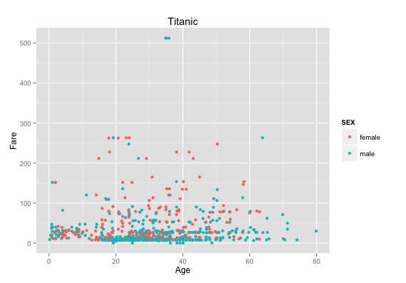
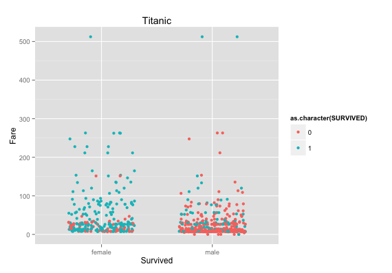

After creating a repository on GitHubt to manage our code, we then created a dataframe from the titanic data. Using the SQL statement:
```
SELECT * FROM titanic
```

```{r, include=FALSE}
require("jsonlite")
require("RCurl")
```
``` {r}
# Change the USER and PASS below to be your UTEid
df <- data.frame(fromJSON(getURL(URLencode('129.152.144.84:5001/rest/native/?query="select * from titanic where sex is not null"'),httpheader=c(DB='jdbc:oracle:thin:@129.152.144.84:1521/PDBF15DV.usuniversi01134.oraclecloud.internal', USER='cs329e_mh42375', PASS='orcl_mh42375', MODE='native_mode', MODEL='model', returnDimensions = 'False', returnFor = 'JSON'), verbose = TRUE), ))
```

**7. Display a subset and summary of the Titanic data frame.** 

Subsets:  
```{r, echo=FALSE}
head(subset(df, select=c(PCLASS, NAME, FARE)))
```
Summary:
```{r, echo=FALSE}
summary(df)
```

**8. Produce one new, interesting plot for the Titanic data.**

**9. Produce the plots**  
*NOTE: The SQL statement indicated was used in the creation of the plots*  

### Plot #2 ###      
**SQL Statement:**  
```
SELECT * FROM titanic WHERE sex is not null
```  
```
ggplot() + 
  coord_cartesian() + 
  scale_x_continuous() +
  scale_y_continuous() +
  labs(title='Titanic') +
  labs(x="Age", y="Fare") +
  layer(data=df, 
        mapping=aes(x=as.numeric(AGE), y=as.numeric(as.character(FARE)), color=SEX), 
        stat="identity", 
        stat_params=list(), 
        geom="point",
        geom_params=list(), 
        position=position_jitter(width=0.3, height=0)
  )  
```
  
This plot visualizes the ages of all passengers versus their ticket fares. They are color coded by sex. A larger number of women paid fares over $200.  
  


### Plot #3 ###  

**SQL Statement:**  
```
SELECT * FROM titanic WHERE sex is not null
```  
```
ggplot() + 
  coord_cartesian() + 
  scale_x_discrete() +
  scale_y_continuous() +
  labs(title='Titanic') +
  labs(x="Survived", y=paste("Fare")) +
  layer(data=df, 
        mapping=aes(x=SEX, y=as.numeric(as.character(FARE)), color=as.character(SURVIVED)), 
        stat="identity", 
        stat_params=list(), 
        geom="point",
        geom_params=list(), 
        position=position_jitter(width=0.3, height=0)
  )
```
This plot visualizes the surviving males and females on the Titanic and their ticket fares. More women surivived the crash, which is not surprising because they were the ones allowed onto the life boats first, along with children.  

  
### Plot #4 ### 

**SQL Statement:**   
```
SELECT * FROM titanic WHERE where sex is not null"
```  
```
ggplot() + 
  coord_cartesian() + 
  scale_x_discrete() +
  scale_y_continuous() +
  facet_grid(PCLASS~SURVIVED, labeller=label_both) +
  labs(title='Titanic') +
  labs(x="Survived", y=paste("Fare")) +
  layer(data=df, 
        mapping=aes(x=SEX, y=as.numeric(as.character(FARE)), color=SEX), 
        stat="identity", 
        stat_params=list(), 
        geom="point",
        geom_params=list(), 
        position=position_jitter(width=0.3, height=0)
  )
```  
This plot shows whether passengers survived based on their ticket fare, sex, and class. Passengers in classes 1 and 2 were more likely to survive if they were females. Passengers in class 3 were less likely to survive than passengers in classes 1 and 2, whether they were male or female.  

  
### Plot #5 ### 

**SQL Statement:**  
```
SELECT * FROM titanic WHERE age <= 10"
```  
```
ggplot() + 
  coord_cartesian() + 
  scale_x_discrete() +
  scale_y_continuous() +
  facet_grid(PCLASS~SURVIVED, labeller=label_both) +
  labs(title='Titanic where age <= 10') +
  labs(x="Survived", y=paste("Fare")) +
  layer(data=df, 
        mapping=aes(x=SEX, y=as.numeric(as.character(FARE)), color=SEX), 
        stat="identity", 
        stat_params=list(), 
        geom="point",
        geom_params=list(), 
        position=position_jitter(width=0.3, height=0)
  )
```  
This plot shows the survival of passengers under the age of ten based on class, sex, and ticket fare. There is no clear difference between the survival of children in class 3, but class 2 children all survived.    

