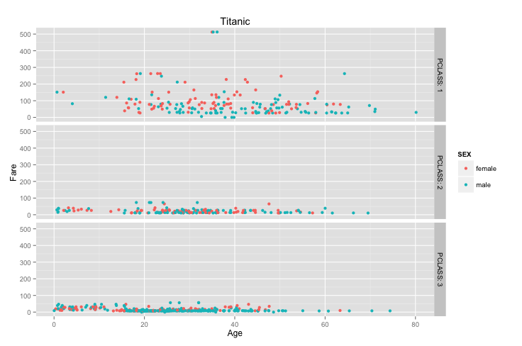

**1. First, create a GitHub Repository and name it "DV_RProject1"**  


**2. Create a folder in the Data Visualization folder for all project contents. Clone the DV_RProject1 Repository into that folder.**


**3. Create an RStudio DV_RProject1 Project in the same folder you created earlier.**


**4. Create structures in the RStudio DV_RProject1 project:**
    00 Doc
    01 Data
    02 Visualizations


**5. Build an html file using KnitR that reproduces your project.**


**6. Build a data frame for the Titanic data.**

```{r, include=FALSE}
require("jsonlite")
require("RCurl")
```
``` {r}
# Change the USER and PASS below to be your UTEid
df <- data.frame(fromJSON(getURL(URLencode('129.152.144.84:5001/rest/native/?query="select * from titanic where sex is not null"'),httpheader=c(DB='jdbc:oracle:thin:@129.152.144.84:1521/PDBF15DV.usuniversi01134.oraclecloud.internal', USER='cs329e_mh42375', PASS='orcl_mh42375', MODE='native_mode', MODEL='model', returnDimensions = 'False', returnFor = 'JSON'), verbose = TRUE), ))
```

**7. Display a subset and summary of the Titanic data frame.** 

Subsets:  
```{r, echo=FALSE}
head(subset(df, select=c(PCLASS, NAME, FARE)))
```
Summary:
```{r, echo=FALSE}
summary(df)
```

**8. Produce one new, interesting plot for the Titanic data.**
```
SELECT * FROM titanic WHERE sex is not null
```  
```
ggplot() +
  coord_cartesian() +
  scale_x_continuous() +
  scale_y_continuous() +
  facet_grid(PCLASS~., labeller = label_both) +
  labs(title="Titanic", x="Age", y="Fare")+
  layer(data=df,
        mapping=aes(x=as.numeric(as.character(AGE)), y=as.numeric(as.character(FARE)), color=SEX),
        stat="identity",
        stat_params=list(),
        geom="point", geom_params=list(),
        position=position_jitter(width=0.5,height=0.3)
  )
```  
  
  
This plot shows the age of passengers plotted against their fares and colored by sex. They are separated by passenger class. It demonstates that passengers in low classes (2 and 3) all paid less than $100 for their fares despite their age or sex. In first class, many of the passengers paid over $100, as expected. However, it is interesting that there are more women that paid over $100 in first class than men. While men did pay the highest price out of all the ticket fares, a larger number of women had more expensive tickets, and were a younger age than men that paid a lower price for their first class tickets.  
  
**9. Produce the indicated plots**  
*NOTE: The SQL statement indicated was used in the creation of the plots*  

### Plot #1 ###
**SQL Statement:**  
```
SELECT * FROM titanic
```  
```
ggplot() + 
  coord_cartesian() + 
  scale_x_continuous() +
  scale_y_continuous() +
  labs(title='Titanic') +
  labs(x="Age", y="Fare") +
  layer(data=df, 
        mapping=aes(x=as.numeric(as.character(AGE)), y=as.numeric(as.character(FARE)), color=SEX), 
        stat="identity", 
        stat_params=list(), 
        geom="point",
        geom_params=list(), 
        position=position_jitter(width=0.3, height=0)
  )
```
This plot visualizes the ages of all passengers versus their ticket fares. They are color coded by sex, and the legend includes a "null" category. A larger number of women paid fares over $200. 

### Plot #2 ###      
**SQL Statement:**  
```
SELECT * FROM titanic WHERE sex is not null
```  
```
ggplot() + 
  coord_cartesian() + 
  scale_x_continuous() +
  scale_y_continuous() +
  labs(title='Titanic') +
  labs(x="Age", y="Fare") +
  layer(data=df, 
        mapping=aes(x=as.numeric(AGE), y=as.numeric(as.character(FARE)), color=SEX), 
        stat="identity", 
        stat_params=list(), 
        geom="point",
        geom_params=list(), 
        position=position_jitter(width=0.3, height=0)
  )  
```
  
This plot visualizes the ages of all passengers versus their ticket fares. They are color coded by sex. A larger number of women paid fares over $200.  
  


### Plot #3 ###  

**SQL Statement:**  
```
SELECT * FROM titanic WHERE sex is not null
```  
```
ggplot() + 
  coord_cartesian() + 
  scale_x_discrete() +
  scale_y_continuous() +
  labs(title='Titanic') +
  labs(x="Survived", y=paste("Fare")) +
  layer(data=df, 
        mapping=aes(x=SEX, y=as.numeric(as.character(FARE)), color=as.character(SURVIVED)), 
        stat="identity", 
        stat_params=list(), 
        geom="point",
        geom_params=list(), 
        position=position_jitter(width=0.3, height=0)
  )
```
This plot visualizes the surviving males and females on the Titanic and their ticket fares. More women surivived the crash, which is not surprising because they were the ones allowed onto the life boats first, along with children.  

  
### Plot #4 ### 

**SQL Statement:**   
```
SELECT * FROM titanic WHERE where sex is not null"
```  
```
ggplot() + 
  coord_cartesian() + 
  scale_x_discrete() +
  scale_y_continuous() +
  facet_grid(PCLASS~SURVIVED, labeller=label_both) +
  labs(title='Titanic') +
  labs(x="Survived", y=paste("Fare")) +
  layer(data=df, 
        mapping=aes(x=SEX, y=as.numeric(as.character(FARE)), color=SEX), 
        stat="identity", 
        stat_params=list(), 
        geom="point",
        geom_params=list(), 
        position=position_jitter(width=0.3, height=0)
  )
```  
This plot shows whether passengers survived based on their ticket fare, sex, and class. Passengers in classes 1 and 2 were more likely to survive if they were females. Passengers in class 3 were less likely to survive than passengers in classes 1 and 2, whether they were male or female.  

  
### Plot #5 ### 

**SQL Statement:**  
```
SELECT * FROM titanic WHERE age <= 10"
```  
```
ggplot() + 
  coord_cartesian() + 
  scale_x_discrete() +
  scale_y_continuous() +
  facet_grid(PCLASS~SURVIVED, labeller=label_both) +
  labs(title='Titanic where age <= 10') +
  labs(x="Survived", y=paste("Fare")) +
  layer(data=df, 
        mapping=aes(x=SEX, y=as.numeric(as.character(FARE)), color=SEX), 
        stat="identity", 
        stat_params=list(), 
        geom="point",
        geom_params=list(), 
        position=position_jitter(width=0.3, height=0)
  )
```  
This plot shows the survival of passengers under the age of ten based on class, sex, and ticket fare. There is no clear difference between the survival of children in class 3, but class 2 children all survived.    
