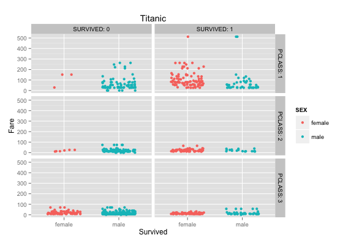

**1. First, create a GitHub Repository and name it "DV_RProject1"**


**2. Create a folder in the Data Visualization folder for all project contents. Clone the DV_RProject1 Repository into that folder.**


**3. Create an RStudio DV_RProject1 Project in the same folder you created earlier.**


**4. Create structures in the RStudio DV_RProject1 project:**
    00 Doc
    01 Data
    02 Visualizations


**5. Build an html file using KnitR that reproduces your project.**


**6. Build a data frame for the Titanic data.**

```{r, include=FALSE}
require("jsonlite")
require("RCurl")
```
``` {r}
# Change the USER and PASS below to be your UTEid
df <- data.frame(fromJSON(getURL(URLencode('129.152.144.84:5001/rest/native/?query="select * from titanic where sex is not null"'),httpheader=c(DB='jdbc:oracle:thin:@129.152.144.84:1521/PDBF15DV.usuniversi01134.oraclecloud.internal', USER='cs329e_mh42375', PASS='orcl_mh42375', MODE='native_mode', MODEL='model', returnDimensions = 'False', returnFor = 'JSON'), verbose = TRUE), ))
```
**7. Display a subset and summary of the Titanic data frame.** 

Subsets:
```{r, echo=FALSE}
head(df)
```
Summary:
```{r, echo=FALSE}
summary(df)
```

**8. Produce one new, interesting plot for the Titanic data.**

**9. Produce the plots**  

### Graph #2 ###    
SQL Statement:

"select * from titanic where sex is not null"

```
ggplot() + 
  coord_cartesian() + 
  scale_x_continuous() +
  scale_y_continuous() +
  labs(title='Titanic') +
  labs(x="Age", y="Fare") +
  layer(data=df, 
        mapping=aes(x=as.numeric(AGE), y=as.numeric(as.character(FARE)), color=SEX), 
        stat="identity", 
        stat_params=list(), 
        geom="point",
        geom_params=list(), 
        position=position_jitter(width=0.3, height=0)
  )  
```


### Graph #3 ###  

SQL Statement:  

"select * from titanic where age is not null"

```
ggplot() + 
  coord_cartesian() + 
  scale_x_discrete() +
  scale_y_continuous() +
  labs(title='Titanic') +
  labs(x="Survived", y=paste("Fare")) +
  layer(data=df, 
        mapping=aes(x=SEX, y=as.numeric(as.character(FARE)), color=as.character(SURVIVED)), 
        stat="identity", 
        stat_params=list(), 
        geom="point",
        geom_params=list(), 
        position=position_jitter(width=0.3, height=0)
  )
```

  
### Graph #4 ### 

SQL Statement:  

"select * from titanic where age where sex is not null"

```
ggplot() + 
  coord_cartesian() + 
  scale_x_discrete() +
  scale_y_continuous() +
  facet_grid(PCLASS~SURVIVED, labeller=label_both) +
  labs(title='Titanic') +
  labs(x="Survived", y=paste("Fare")) +
  layer(data=df, 
        mapping=aes(x=SEX, y=as.numeric(as.character(FARE)), color=SEX), 
        stat="identity", 
        stat_params=list(), 
        geom="point",
        geom_params=list(), 
        position=position_jitter(width=0.3, height=0)
  )
```

  
### Graph #5 ### 
SQL Statement:  
"select * from titanic where age <= 10"
```
ggplot() + 
  coord_cartesian() + 
  scale_x_discrete() +
  scale_y_continuous() +
  facet_grid(PCLASS~SURVIVED, labeller=label_both) +
  labs(title='Titanic where age <= 10') +
  labs(x="Survived", y=paste("Fare")) +
  layer(data=df, 
        mapping=aes(x=SEX, y=as.numeric(as.character(FARE)), color=SEX), 
        stat="identity", 
        stat_params=list(), 
        geom="point",
        geom_params=list(), 
        position=position_jitter(width=0.3, height=0)
  )
```  
